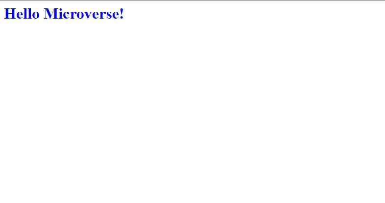

# Hello Microverse

> This is my first microverse project

Additional description about the project and its features.

## Built With

- HTML
- CSS

## Getting Started

To get a local copy up and running follow these simple example steps.

### Prerequisites
Knowledge on basic html and css

### Setup
- clone repository
- run `live server`

## Authors

👤 **Amedzro Elikplim Emmanuel**

- GitHub: [@githubhandle](https://github.com/Amedzro-Elikplim)
- Twitter: [@twitterhandle](https://twitter.com/Amedzro-Elikplim)
- LinkedIn: [LinkedIn](https://www.linkedin.com/in/emmanuel-elikplim-amedzro-187590125/)

## 🤝 Contributing

Contributions, issues, and feature requests are welcome!

Feel free to check the [issues page](../../issues/).

## Show your support

Give a ⭐️ if you like this project!

## 📝 License

This project is [MIT](./MIT.md) licensed.